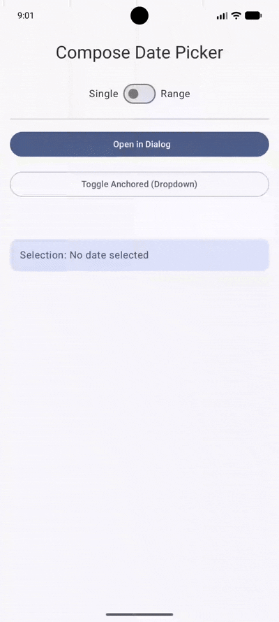
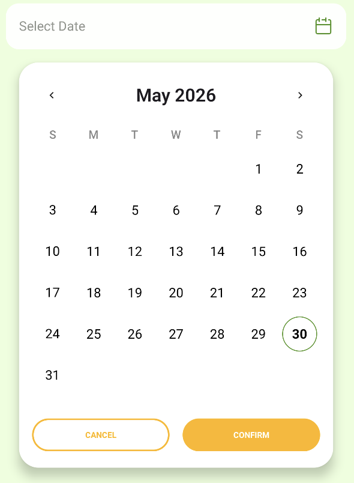
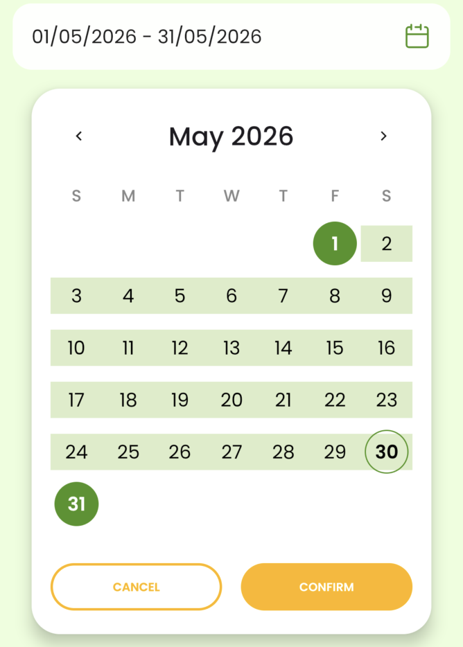

# ComposeDatePicker

[](https://central.sonatype.com/artifact/dev.mikelau/compose-datepicker)
[](https://opensource.org/licenses/Apache-2.0)

A lightweight, customizable Date Picker for Jetpack Compose and Compose Multiplatform, built with Material 3.

## Features

- 📅 **Single Date Selection**: Simple and intuitive date picking.
- ↔️ **Range Date Selection**: Easy start and end date selection with range highlighting.
- 🎨 **Material 3**: Designed with modern Material 3 components and principles.
- 🌍 **Compose Multiplatform**: Ready for Android and iOS.
- 🛠️ **Customizable**: Easy to theme with your application's colors.

## Installation

The library is available on **Maven Central**. Add the repository to your `settings.gradle.kts` if not already present:

```kotlin
dependencyResolutionManagement {
    repositories {
        google()
        mavenCentral()
    }
}
```

|Sample App|Android|iOS|
|--|--|--|
||||

### Android (Kotlin DSL)

Add the dependency to your module's `build.gradle.kts`:

```kotlin
dependencies {
    implementation("dev.mikelau:compose-datepicker-android:1.0.3")
}
```

### Kotlin Multiplatform (KMP)

In your shared module's `build.gradle.kts`:

```kotlin
kotlin {
    sourceSets {
        commonMain.dependencies {
            implementation("dev.mikelau:compose-datepicker:1.0.3")
        }
    }
}
```

### Version Catalog (`libs.versions.toml`)

```toml
[versions]
composeDatePicker = "1.0.3"

[libraries]
compose-datepicker = { group = "dev.mikelau", name = "compose-datepicker", version.ref = "composeDatePicker" }
```

Then in `build.gradle.kts`:

```kotlin
commonMain.dependencies {
    implementation(libs.compose.datepicker)
}
```

## Requirements

- **Android**: minSdk 24+
- **Kotlin**: 2.0+
- **Compose Multiplatform**: 1.6+
- **Targets**: Android, iOS (arm64, simulatorArm64)

## Usage

### Single Date Selection

```kotlin
val state = remember { DatePickerState(selectionMode = DatePickerState.SelectionMode.Single) }

ComposeDatePicker(
    state = state,
    onConfirm = { confirmedState ->
        println("Selected date: ${confirmedState.selectedDate}")
    },
    onCancel = { /* Handle cancel */ }
)
```

### Range Date Selection

```kotlin
val state = remember { DatePickerState(selectionMode = DatePickerState.SelectionMode.Range) }

ComposeDatePicker(
    state = state,
    onConfirm = { confirmedState ->
        println("Selected range: ${confirmedState.rangeStart} to ${confirmedState.rangeEnd}")
    },
    onCancel = { /* Handle cancel */ }
)
```

### Customizing Colors

You can easily override the default colors to match your brand:

```kotlin
ComposeDatePicker(
    primaryColor = Color(0xFF6200EE),
    accentColor = Color(0xFF03DAC6),
    rangeColor = Color(0xFFBB86FC),
    onConfirm = { /* ... */ }
)
```

## DatePickerState

`DatePickerState` provides access to the current selection:

- `selectedDate`: The currently selected `LocalDate` (Single mode).
- `rangeStart`: The start of the selected range (Range mode).
- `rangeEnd`: The end of the selected range (Range mode).
- `currentMonth`: The month currently being displayed in the picker.

## Dependencies

- [Kotlinx Datetime](https://github.com/Kotlin/kotlinx-datetime)
- Jetpack Compose / Compose Multiplatform (Material 3)

## License

```
Copyright 2026 Mike Lau

Licensed under the Apache License, Version 2.0 (the "License");
you may not use this file except in compliance with the License.
You may obtain a copy of the License at

    http://www.apache.org/licenses/LICENSE-2.0
```
